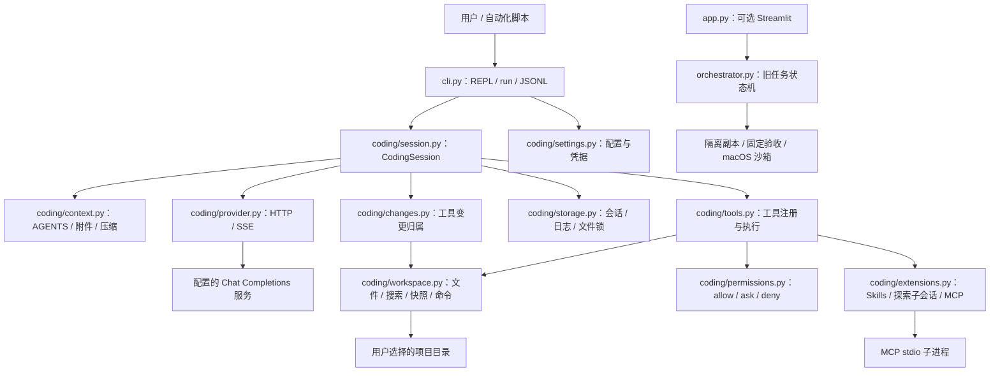

# 当前代码架构

日期：2026-09-15。项目采用单进程 Python 架构，模型服务通过 HTTP 访问，Shell 和 MCP 工具通过受控生命周期的本地子进程执行。

主要入口是独立 `agent-harness` CLI。原有 Streamlit 网页仍可选安装运行。两套执行引擎同时保留：CLI 面向直接在项目内持续协作，旧网页保留隔离副本实验与历史任务验收行为。

## 模块职责

| 模块 | 主要职责与接口 | 它不负责什么 |
| --- | --- | --- |
| `cli.py` | 参数解析、终端显示、交互确认、斜杠命令、退出码 | 不实现模型循环或文件编辑规则 |
| `coding/session.py` | `run()`、`diff()`、`undo()`、`compact()`；串联模型和工具，恢复、预算、验证 | 不自行解析 HTTP 流或实现文件补丁 |
| `coding/provider.py` | `complete()`、`models()`；HTTP/SSE、工具参数拼装、有限重试、取消 | 不执行模型请求的工具 |
| `coding/tools.py` | 工具 Schema、参数检查、统一授权入口、验证命令 | 不拥有会话生命周期 |
| `coding/permissions.py` | `action()` 和 `require()`；模式限制、规则和交互授权 | 文件或模型文本不能修改这里的决策 |
| `coding/workspace.py` | 目录范围、敏感路径、读后编辑、文件冲突、Diff、快照、恢复、子进程 | 不把已批准的任意 Shell 当成受文件工具规则约束的沙箱 |
| `coding/changes.py` | 工具执行前日志、实际触及文件、变更归属与未知操作恢复 | 不把等待模型期间的用户修改归入 Agent 撤销 |
| `coding/storage.py` | 原子 JSON、JSONL 事件、会话锁、列表、导入导出 | 导入会话不授予覆盖当前文件的权限 |
| `coding/context.py` | 项目指令、文本附件、按完整工具组压缩、流式已知凭据脱敏 | 不修改磁盘上的完整会话来节省模型上下文 |
| `coding/extensions.py` | 本地 Skills、只读探索子会话、MCP stdio 生命周期与协议 | 子任务不提供更高权限；MCP 不能自行获取宿主模型采样能力 |
| `coding/settings.py`、`types.py` | 不可变配置、公共结果和稳定错误码 | 不保存 API Key 到项目配置 |

CLI 仅复用旧模块中小而稳定的能力：Unified Diff 解析器、原子文本写入、脱敏工具。它没有再套一层调用旧版 1,559 行的 `TaskOrchestrator`。旧网页仍使用 `orchestrator.py`、旧 `tools.py`、`model_adapter.py`、`snapshot.py`、`validation.py` 和 `trace.py`。

## 一轮任务的执行过程

1. 获取会话锁和项目执行锁，读取最新状态。若上个进程中断，补齐未确认工具结果并保留现场。
2. 加载指令、附件与任务文本，保存轮次开始信息和用户消息；仅在获准工具实际执行前记录相关现场。
3. 在请求预算内组装上下文，流式调用模型。对外仅发送文本、工具和状态事件，私有推理元数据只用于模型连续性。
4. 模型返回工具调用后，先持久化完整调用列表，再按顺序授权与执行。每个结果立即持久化。
5. 普通工具错误反馈给模型继续修复；无交互授权不足则返回退出码 3。达到请求、Token、时间或重复操作限制则停止。
6. 模型输出最终答案时，如果修改过文件且配置了验证命令，宿主确认最新文件状态已经验证。未通过就将失败结果送回模型修复。
7. 保存本轮变更、状态和用量。文件和会话都保留，之后可继续、查看 Diff 或撤销。

`completed` 表示当前对话轮正常结束。`verification=passed` 才表示配置的验证命令对当前状态通过。未配置命令时为 `not_configured`；纯问答允许不修改文件。

## 状态与恢复

会话保存在数据目录的 `cli/sessions/<id>.json`，事件保存在同名 `.jsonl`。会话文件用临时文件、fsync 和原子替换保存，文件权限 0600，会话目录 0700。

`messages` 保存对话；`active` 保存本轮工具造成的变更及当前工具执行前的现场；`pending` 保存未确认的工具；`turns` 保存完成轮次的变更；`redo` 保存已撤销轮次。进程重启不会执行 pending 中的命令，只会提供“操作可能执行过，需要检查”的工具结果。中断时尚未确认归属的变更可查看 Diff，但禁止自动撤销，需要人工检查后恢复。

撤销按用户轮次进行，同时恢复相关文件、对话和待办。恢复前检查所有目标文件是否仍等于预期版本，发现外部变化则整体拒绝。导出会话省略快照、重做数据和私有推理；导入是新的会话，不继承撤销权限。

Shell 的外部目录、网络、数据库、被忽略文件或超大文件副作用不在快照保证之内。快照用于可见普通项目文件；文件工具明确访问的被忽略文件会额外纳入快照。它不是文件系统事务或系统级备份。文件工具仅记录实际触及的文件；等待模型期间的外部修改不会归入本轮撤销。Shell/MCP 执行窗口内的并发外部写入无法可靠区分归属，应避免同时修改同一工程。

## 配置与信任

配置优先级：命令行 > `AGENT_HARNESS_*` 环境变量 > 项目 `.agent-harness.toml` > 用户配置。连接凭据来自指定环境变量或用户凭据文件。旧 `.agent-harness.json` 的验证命令和路径配置仍可读取。

默认读取操作可用，写入、Shell、网络抓取和 MCP 需要授权。Plan 模式禁止修改、Shell 和 MCP，`--yes` 也不能解除。项目配置可以添加 ask/deny，不能添加 allow；AGENTS.md、Skill 和工具输出不参与授权决策。

终端与模型请求中的已知凭据经过脱敏，跨 SSE chunk 的凭据前缀会缓冲。私有 reasoning 字段保留在受保护本地会话中以支持部分模型续轮，但不会显示在事件、终端和导出文件中。

## 旧版沙箱修复

`sandbox.py` 仅供旧网页执行路径使用。Homebrew Python 的外层可执行文件会启动 Framework 内的 `Resources/Python.app/Contents/MacOS/Python`。新增精确的第二层执行路径，并允许解析 Python 安装目录与启动器符号链接所需的路径元数据。没有扩大文件内容读取、写入或网络权限。旧版辅助脚本与自主验收回归均覆盖这一修改。
