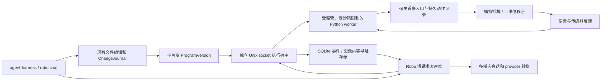

# Robo 0.1 架构与运行约定

## 模块

- `robo/programs.py`：显式文件清单、Python 依赖快照、SDK/解释器身份、不可变发布物、沙箱启动约定。
- `robo/runtime.py`：job 与资源占用、设备授权、动作意图和核对、子进程监管、取消和观察验证。逻辑不进入 `CodingSession._run()`。
- `robo/hardware.py`：自定义模拟相机与位移台、明确的 MHS 不可用状态。未来真实驱动须实现实际规范，再接宿主约束入口。
- `robo/store.py`：SQLite 对象、持久顺序事件。WAL + synchronous FULL；观测、日志、动作、异常、验证关联 job/version。
- `robo/worker.py`：随版本冻结的 Python SDK；通过继承管道调用设备，没有宿主管理凭据。红色标记 centroid 由像素计算，远端模型不在本地反馈关键路径中。
- `robo/host.py`、`client.py`：owner-only Unix socket，独立进程。每次请求独立连接；订阅用游标和有界长轮询，断开后可续读。
- `robo/tools.py`：注册 ExtraTool；复用原来的权限、编辑、模型和预算。观察和轮询不触发代码文件快照；轮询仍受回合/时间/令牌预算限制。
- `coding/media.py`：图像内容寻址、验证、可携带媒体导入导出、provider 格式转换。旧文本记录仍可读取。

## 生命周期

`starting → running → exited / failed / timed_out / cancelled`。取消先变为 `cancelling` 并撤销设备入口权限；停止 worker 后取得模拟设备 `stop_confirmation`，再释放共享 `sim-workcell`。包括相机、目标物和运动台在内的工作单元整体互斥。`exited` 仅表示退出码为零；`physical_verification` 独立为 succeeded/failed/unknown。

- **模型结束或取消**：不向宿主取消 continue_bounded job。
- **客户端断连**：continue_bounded 继续到程序结束或墙钟上限；cancel 策略要求每 5 秒以内轮询 events，断连后租约过期即取消。显式 disconnect 立即按此策略处理。status 查询不续租。
- **用户取消程序**：`cancel` 返回请求状态；查询 status/events 直到 `cancelled` 和确认状态。可能已经发生的位移仍存在。
- **宿主正常关闭**：停止接单，取消并确认现有 job。
- **宿主崩溃**：旧管道不再接受设备请求，worker 不能重连取得管理权限；重启后观察并标记旧 job interrupted，不自动重放代码/动作。模拟运动是瞬时的，实机失联处置还必须由真实驱动/控制器实现。
- **设备保护**：`protect` 是独立锁存通路，可中止所有任务；没有自动复位工具，不等同于硬件急停。

## 版本与隔离

发布时复制清单中所有 Python 文件，包含本地依赖；entrypoint 必须在清单中。`dependencies` 目前只能为空，第三方依赖须以 Python 源码形式 vendored 并列入清单。SDK、stdlib Python 源码和 native extension 模块冻结到约 10 MiB 的共享内容寻址 runtime。每次启动核对入口包、库、SDK 和基础解释器 SHA-256。使用 `-I -S -B` 且以固定 archive/library 替换导入路径，不读工作区或 site-packages。后续编辑和 undo 不影响 job。系统动态库是宿主平台依赖，不宣称完整 OS 镜像可复现。

macOS Seatbelt 禁止网络、fork、文件写入和工作区/宿主数据读取，只读冻结程序、Python 安装和必需系统库。物理调用走 job 专属管道并由宿主逐次检查；用户 shell 仍是旧 CLI 的可信本机执行，因此**本版只启用模拟设备，不具备授权真实硬件给任意 shell 的隔离方案**。Linux 运行程序会明确失败 `sandbox_unavailable`；没有静默无隔离执行。

CPU 由 OS rlimit，墙钟由宿主，RSS 由宿主约 20 ms 调度循环采样检查；RSS 是采样停止阈值，分配突发和调度可能导致超出，不能用作严格内存预留或实时保证。其他限制包括动作数、日志字节、事件数、步幅、速度、参数范围与观察年龄。manifest 只能收紧内置模拟策略上限；goal/验证器不能由程序更改。

## 观察和物理验证

观察含来源、采样/接收时间、单调序号、坐标、单位、标定、质量、job/version 和内容寻址 PNG。本地 SDK 收到当前原始 RGB；模型按工具结果收到压缩 PNG，最多八帧/请求、单帧 2 MiB、总计 8 MiB。内部 `image_ref` 保留在会话里，provider 将其转成 `image_url`。Chat Completions 的 tool 消息保留文本，帧作为完整 tool group 之后的 user evidence 消息；不破坏调用/结果配对。图像附件支持 PNG/JPEG/WebP；时间帧序列可表达视频观察，原生视频传输尚未实现。

对准控制用红色像素 centroid，独立验证用动作后的模拟编码器位置。默认目标 (0,0) mm、欧氏误差 ≤1 mm，3 个间隔 20 ms 的观察样本。它检验当前短窗口，不证明长期稳定或现实相机可靠性。程序正常退出、异常甚至取消都可以与不同物理结果组合；证据缺失则 unknown。

动作先持久化意图，再派发。相同 command ID 同参数返回原记录，不同参数拒绝。丢回执后写为 unknown，先查询原动作并重观测，禁止直接发新动作。无端到端 exactly-once 承诺。

## 审查后的补充约定

每次模型请求前自动读取有界现场摘要：当前模拟设备状态、采样时间、最近 8 个本会话关联的 job/version、执行/验证状态和最新事件游标。它不追加无限媒体，也不把历史 running 当作当前状态。会话存储保留关联 ID，undo 不删除运行记录；原始图像/日志仍按需从事件读取。

宿主独占 liveness 管道写端，worker 监视其 EOF；即便程序处于 sleep、未调用 SDK，宿主被 SIGKILL 后 worker 也退出。worker 回复通道非阻塞且有积压上限，防止不读取 SDK 回应的程序卡住超时/取消监管。模型端客户端复用可取消异步 I/O，停止模型只中断该等待；任务继续遵守自己的策略。

cancel 策略只在真实 events 请求开始时续租一次，服务器等待唤醒不能续租；该策略下单次长轮询至多 4 秒。任务结束和宿主重启都会查询并观测未确认动作，先留下 action_reconciled 证据；仍有 unknown/dispatching 的动作时，其他 job 不能取得控制权。停止确认不能代替动作影响核对。

旧 Web 实验引擎在当前 `venv --copies` 下的回归暴露了复制式 Python.framework 启动器路径缺口；共享 sandbox helper 现在核对 pyvenv.cfg 指定基础解释器与实际副本的哈希，再授予精确的 framework 启动器规则。没有扩大文件写入或网络权限。
